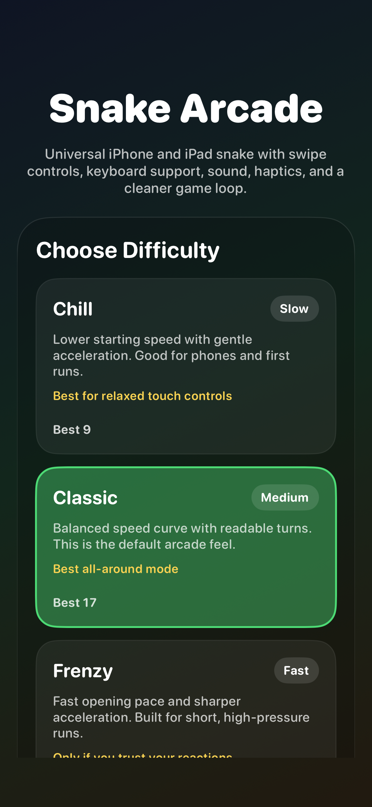
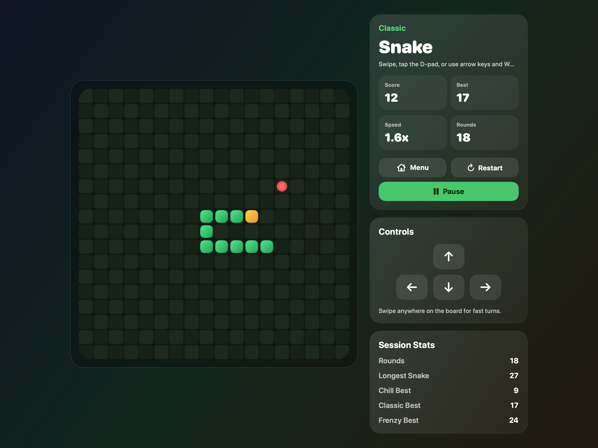
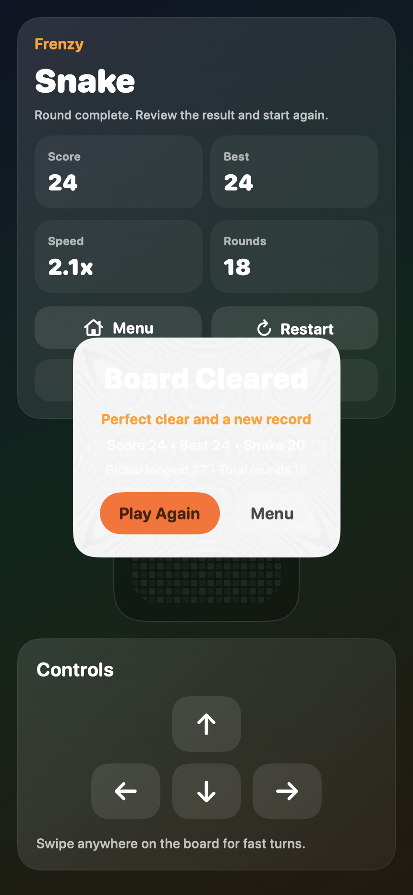

# SnakeGame


SwiftUI snake for iPhone and iPad, built as a polished local arcade app.

一個使用 `SwiftUI` 製作、可同時跑在 `iPhone` 與 `iPad` 的單機貪吃蛇遊戲，重點放在手感、穩定的 game loop，以及可維護的結構分層。

**Built through a Codex agent-driven workflow.**

**本專案以 Codex Agent 為核心工作流完成，包含實作、重構、測試與 README / 截圖產生。**

This project showcases testable game logic, universal iPhone/iPad UI, and an agent-assisted iOS delivery workflow.

`SwiftUI` · `Universal iPhone/iPad` · `Local Stats` · `Touch + Keyboard Controls`

## Demo / 專案定位

SnakeGame is a universal iOS arcade project focused on clean game rules, responsive controls, and a maintainable SwiftUI architecture rather than a one-file prototype.

這不是只求能跑的單檔 demo，而是一個已經拆出 `engine / model / stores / services / views` 分層、可持續擴充的 iOS 小遊戲專案。

- Repo: [github.com/Corgizzz/SnakeGame](https://github.com/Corgizzz/SnakeGame)
- Current build target: `iPhone` and `iPad`
- Current input methods: swipe, on-screen D-pad, arrow keys, `WASD`

## Version / 版本資訊

| Item | Value |
| --- | --- |
| Project type | AI-assisted iOS portfolio project |
| Current milestone | Playable `v1.1` |
| Platform | iOS 17+ |
| Layout | Universal iPhone + iPad |
| Validation | `15` unit tests + simulator screenshots |
| Persistence | Local-only (`UserDefaults`) |

## Engineering Highlights / 工程亮點

- Pure `SnakeGameEngine` separated from UI state, so movement, collisions, and victory logic stay testable.
- Explicit session state machine: `menu / countdown / running / paused / gameOver`.
- Universal iPhone + iPad layout with swipe input, on-screen D-pad, and keyboard controls.
- Automated simulator screenshot pipeline for README assets, captured from real simulator runs.

## Role / 我的角色與工作流

- Product direction and iteration goals were defined through human prompting and review.
- Implementation, refactoring, tests, and documentation were produced through Codex agent workflows.
- Final output was validated through iterative bug fixing, simulator screenshots, and test runs.

This project was produced primarily through Codex agent workflows, with human input focused on prompts, review, and iteration decisions.

## Screenshots / 畫面預覽

> The screenshots below are captured from automated simulator runs of the app: `iPhone 16` for menu/result and `iPad Pro 13-inch (M4)` for gameplay.
>
> 下面這組圖已改成真實 simulator 截圖：主選單與結算畫面來自 `iPhone 16`，遊玩畫面來自 `iPad Pro 13-inch (M4)`。

| Menu / 主選單 | Gameplay / 遊玩畫面 | Result / 結算畫面 |
| --- | --- | --- |
|  |  |  |

## Features / 功能特色

- Three difficulty modes: `Chill`, `Classic`, and `Frenzy`, each with a different speed curve and acceleration profile.
  三種難度各自有不同的起始速度與加速曲線，不只是單純改快慢。
- Touch-first controls with swipe input, an on-screen D-pad, plus hardware keyboard support for arrow keys and `WASD`.
  支援滑動操作、螢幕方向鍵，以及外接鍵盤方向鍵與 `WASD`。
- Stable session flow with `menu`, `countdown`, `running`, `paused`, and `gameOver` states.
  遊戲狀態有明確 state machine，避免 timer 重複建立或 lifecycle 混亂。
- Background interruptions pause the round and resume through a countdown instead of dropping the player straight back into motion.
  App 進背景會暫停，回前景會先倒數再恢復，避免直接回到高速狀態。
- Local progress tracking with per-difficulty best scores, recent rounds, longest snake, and total games played.
  內建本地統計，包含各難度最高分、最近幾局、最長蛇身與總遊玩局數。
- Victory handling for full-board clears, plus gameplay feedback such as food pulse, countdown animation, and crash / victory flashes.
  補齊滿版勝利條件，並加入倒數、食物脈動、死亡與勝利回饋動畫。

## Tech Stack / 技術摘要

- `SwiftUI` for app structure and screen composition
- `Canvas` for board rendering
- `AVFoundation` and UIKit feedback generators for sound and haptics
- `UserDefaults` with Codable snapshots for local settings and stats
- `XCTest` for engine and session-state validation

## Architecture / 架構概念

- `SnakeGameEngine`
  Pure game rules. It advances one tick at a time, resolves growth, collision, speed changes, and victory without depending on UI, timers, or persistence.
- `SnakeGameModel`
  Session controller. It owns the countdown, active timer, lifecycle handling, feedback dispatch, and store integration.
- `Stores`
  `GameSettingsStore` keeps sound and haptic preferences. `GameStatsStore` keeps per-difficulty best scores and recent-round history.
- `Views`
  SwiftUI views render state only. They do not write directly to `UserDefaults` and they do not create timers.

## Quick Start / 快速啟動

Open [`SnakeGame.xcodeproj`](/Users/cfh00583031/Desktop/Codex_Game/SnakeGame.xcodeproj) in Xcode and run the `SnakeGame` scheme on an iPhone or iPad destination.

用 Xcode 開啟 [`SnakeGame.xcodeproj`](/Users/cfh00583031/Desktop/Codex_Game/SnakeGame.xcodeproj)，選擇 `SnakeGame` scheme，然後執行到 iPhone 或 iPad 目標即可。

### Build / 編譯

```bash
xcodebuild \
  -project SnakeGame.xcodeproj \
  -scheme SnakeGame \
  -sdk iphonesimulator \
  -configuration Debug \
  -derivedDataPath ./DerivedData \
  CODE_SIGNING_ALLOWED=NO \
  CODE_SIGNING_REQUIRED=NO \
  build
```

### Test / 測試

```bash
xcodebuild \
  -project SnakeGame.xcodeproj \
  -scheme SnakeGame \
  -destination 'platform=iOS Simulator,name=iPhone 16,OS=18.2' \
  -derivedDataPath ./DerivedData_tests \
  CODE_SIGNING_ALLOWED=NO \
  CODE_SIGNING_REQUIRED=NO \
  test
```

## Roadmap / 後續方向

- Add UI tests for menu, countdown, pause, and result flow.
- Extend gameplay with more modes while keeping the current engine deterministic.
- Evaluate Game Center once the local stat model is stable.
- Finish release-ready bundle ID, signing, and device deployment setup.

## Repository Notes / 倉庫說明

- Generated build artifacts such as `DerivedData*`, `.xcresult`, and Xcode user state are ignored in [`.gitignore`](/Users/cfh00583031/Desktop/Codex_Game/.gitignore).
- The repository root stays intentionally small: source, tests, project files, docs, and no committed build output.
